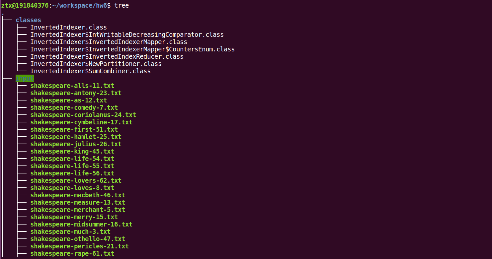
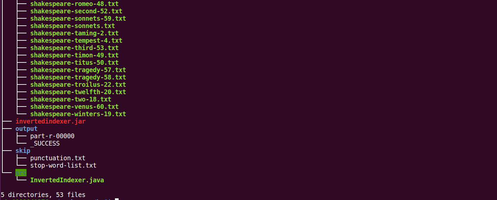
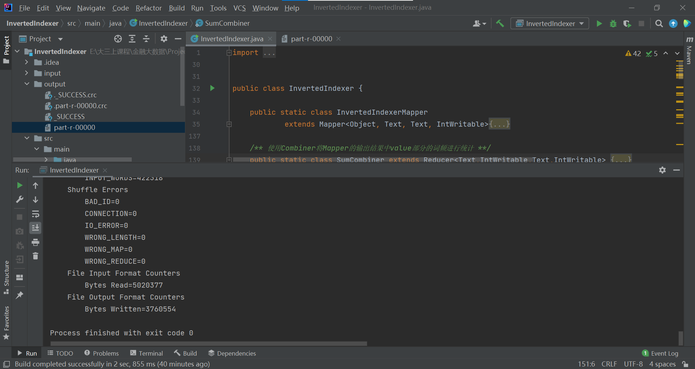
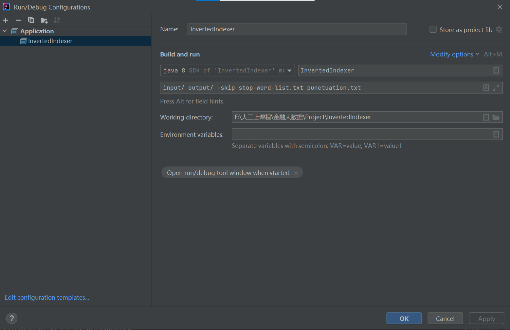
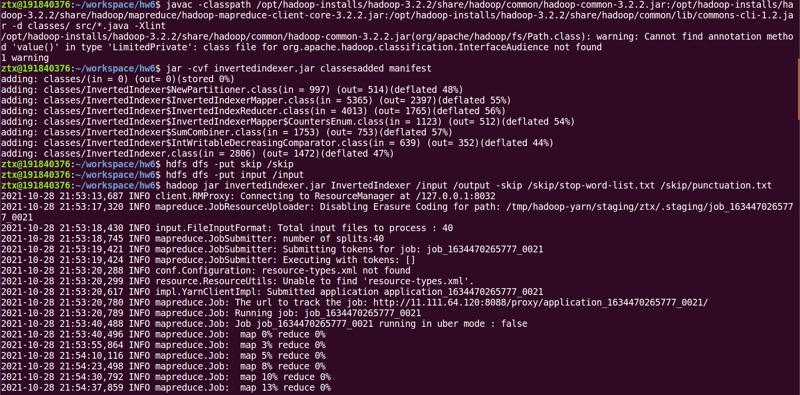
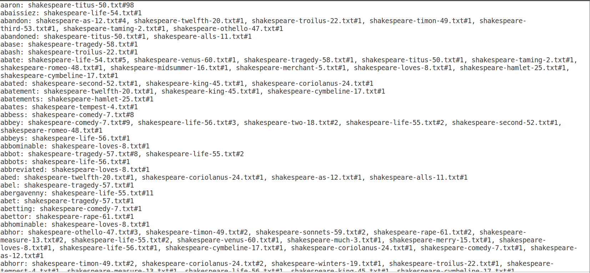
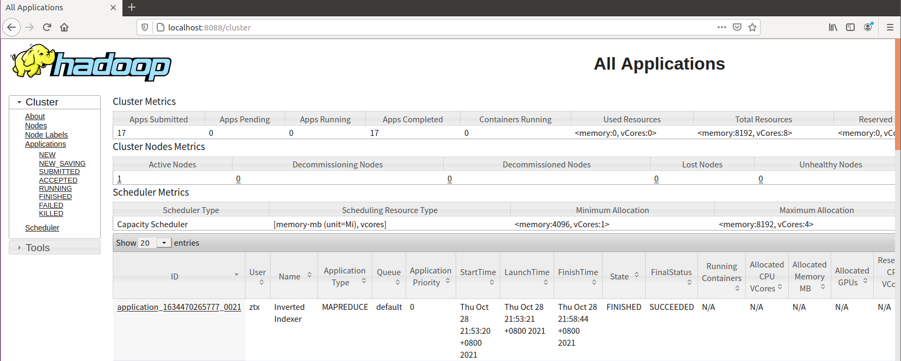
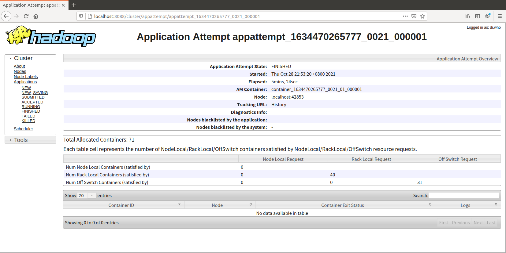

# <center>作业6  倒排索引</center>

<center>朱彤轩 191840376</center>

[TOC]

## 1 代码编写思路

“单词忽略大小写，忽略标点符号（punctuation.txt），忽略停词（stop-word-list.txt），忽略数字，单词长度>=3”等要求在作业5中已经实现，在这里不做赘述。下面介绍整个Mapreduce程序的结构：

### 1.1 Mapper-InvertedIndexerMapper

此mapper接受默认的输入，输出`<word#filename, 1>`，与作业5中的实现思路类似。

### 1.2 Combiner-SumCombiner

使用Combiner将Mapper的输出结果中value部分的词频进行统计，输出`<word#filename, count>`。

### 1.3 Partitioner-NewPartitioner

自定义HashPartitioner，保证 `word#filename`格式的key值按照word分发给Reducer，保证同样的word在同一reducer下。**接下来系统帮忙将所有的key按照字母序排序。**

### 1.4-Reducer-InvertedIndexReducer

定义一个列表存储同一个word的filename和count。我选择按照`count#filename`的格式存储进列表，这样方便在访问完该单词的所有value之后，**单词的索引按照单词在该文档中出现的次数从大到小排序。**

逆序排序之后按照输出格式写入文件。

## 2 文件夹目录结构





- classes：各个类
- input：40个莎士比亚作品txt
- output：倒排索引的结果输出
- skip：标点以及停用词存放
- src：源码

## 3 实验结果

### 3.1 windows系统下运行截图





### 3.2 Linux系统下运行截图

文件编译，文件上传至hdfs文件系统，在终端运行代码：

```shell
ztx@191840376:~/workspace/hw6$ hadoop jar invertedindexer.jar InvertedIndexer /input /output -skip /skip/stop-word-list.txt /skip/punctuation.txt
```



结果输出：



All Applications截图：



job截图：


